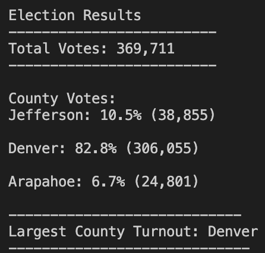

# My_Election_Analysis

## Project Overview
In this analysis we have assisted the Colorado Board of Elections Committee employee Tom, in an election audit for the US Congressional Precinct in Colorado. We have been tasked to tabulate and analyze the election results from the recent election; specifically pertaining to each county and candidate. 
Using the software Python, we will provide Tom with an automated audit process that can be used in various districts and elections. Therefore, we have generated a vote count report to certify the local US Congressional race. This report will provide a two-part analysis pertaining to each candidate and county. In analyzing the candidates, we will perform the following tasks: 
1.	Calculate the total amount of votes cast in the election
2.	Compile a list of the candidates who received votes in the election 
3.   Thereafter, calculate the number of votes each respective candidate received 
4.   Calculate the percentage of votes each candidate received out of the total count
5.	Lastly, determine the winning candidate who received the most votes in the election 

We will perform a similar analysis when analyzing each county:
1.	Calculate the number of votes cast from each county 
2.	Additionally, calculate the percentage of voters for each county out of the total count
3.	Determine the county that had the largest voter turnout and the number of votes cast from this district 

## Resources:
Data Source: election_results.csv

Software: Python 3.8.5 and Visual Studio Code, 1.38.1 

## Election-Audit Results:
### The analysis of the election illustrates the following: 
                                                                                                            
  •	There was a total of **369,711** votes cast in the congressional election
  
  ### The counties included were **Jefferson, Denver, and Arapahoe**
  
   **1.**	The county of **Jefferson** cast **10.5%** of the total votes in the election, with a total of **38,855** votes cast 
    
   **2.**	The county of **Denver** cast **82.8%** of the total votes in the election, with a total of **306,055** votes cast
   
   **3.**	And, the county of **Arapahoe** cast **6.7%** of the total votes in the election, with a total of **24,801** votes cast 
   
   
   
   
   
   
   
  •	It can be determined from the results included above that the county of **Denver** had the largest voter turnout (**306,055**), and consequently
    the highest percentage of voter turnout (**82.8%**)
  
  ### The candidates included were: Charles Casper Stockham, Diana DeGette, and Raymon Anthony Doane 
  
   **1.	Charles Casper Stockham** received a total of **85,213** votes, accounting for **23%** of the total vote count
    
   **2. Diana DeGette** received a total of **272,892** votes, accounting for **73.8%** of the total vote count
   
   **3.** Lastly, **Raymon Anthony Doane** received a total of **11,606** votes, accounting for **3.1%** of the total vote count 
   
    
   
  •	From the data provided above it is concluded that **Diana DeGrette** was the winning candidate of the election as she received the largest amount of votes           (**272,892**), and consequently the highest percentage of votes (**73.8%**)

## Election-Audit Summary:
This script provides you the election committee with ample opportunity when performing future electoral audits, this is due to several factors. 

**1. The Script can be Generalized.**
Firstly, the script that has been used to audit the Colorado election is a malleable script that with slight modifications can be employed in a variety of elections based upon the data given. For example, it could be employed in a federal election wherein the county data instead encompasses each state rather than county and follows the Republican, Democrat, and/or third-party election results. Therefore, instead of just being limited to a single state we are able to modify the script to provide the election committee with a script to audit the election results of the entire United States. 

**2. Analysis of Demographics.**
A second useful component of this script is that it can also offer specificity if we are looking towards certain demographics of voters. For example, we could add a dictionary to the script that would allow us to filter the vote count by each voter’s gender, race, age, etc. By looking at the election results in this manner we are equip to examine the identity politics of the given election which can be resourceful for future or present inquiries. 

